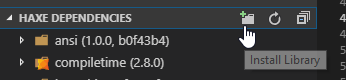

# lix.vscode

    

This Visual Studio Code extension adds support for [lix](https://github.com/lix-pm), a package manager for Haxe.

It makes the following assumptions:

- `npm` and `npx` are available on the command line
- lix is installed locally in the project as opposed to globally
- vshaxe's `"haxe.executable"` and `"haxelib.executable"` settings are at their default values `"auto"` (existing projects may need an update if they explicitly specify the binaries in `node_modules`)

## Features

The extension adds the following features:

### Initialize Project

To get started with lix in a project that doesn't use it yet, run the `lix: Initialize Project` command from the command palette. This does the following:

- installs lix via `npm` and creates a `package.json` if needed
- creates a new scope / `.haxerc` file (equivalent to `lix scope create`)

### Haxe Version Selector

When a `.hx` file is open, the lix extension displays the Haxe version selected for the current project in `.haxerc` in the bottom right of the status bar:

To switch to another installed version, or install a different one, simply click on it or run the `lix: Select Haxe Version` command:

### Install Library

Click the "Install Library" button in the Haxe Dependencies view or run `lix: Install Library` from the command palette to install a library:

### Haxe Installation Auto-Detection

If the `"haxe.executable"` and `"haxelib.executable"` settings are at their default values `"auto"`, they are automatically resolved to the local `haxe` / `haxelib` scripts in `node_modules/.bin` provided by lix.

### Haxe Dependencies Support

With this extension, the installed libraries and their versions, as well as the Haxe standard library, are correctly displayed in the Haxe Depdendencies view:

### Download Missing Dependencies

To install missing dependencies (libraries or Haxe itself), you can run the `lix: Download Missing Dependencies` from the command palette. This is equivalent to running `lix download` on the command line.

### `.haxerc` Support

This extension adds JSON syntax highlighting as well as hover hints and completion with a JSON schema for `.haxerc` files:

### Output Channel

To troubleshoot issues with the extension, open the lix output channel to view the output of commands that have been executed:

